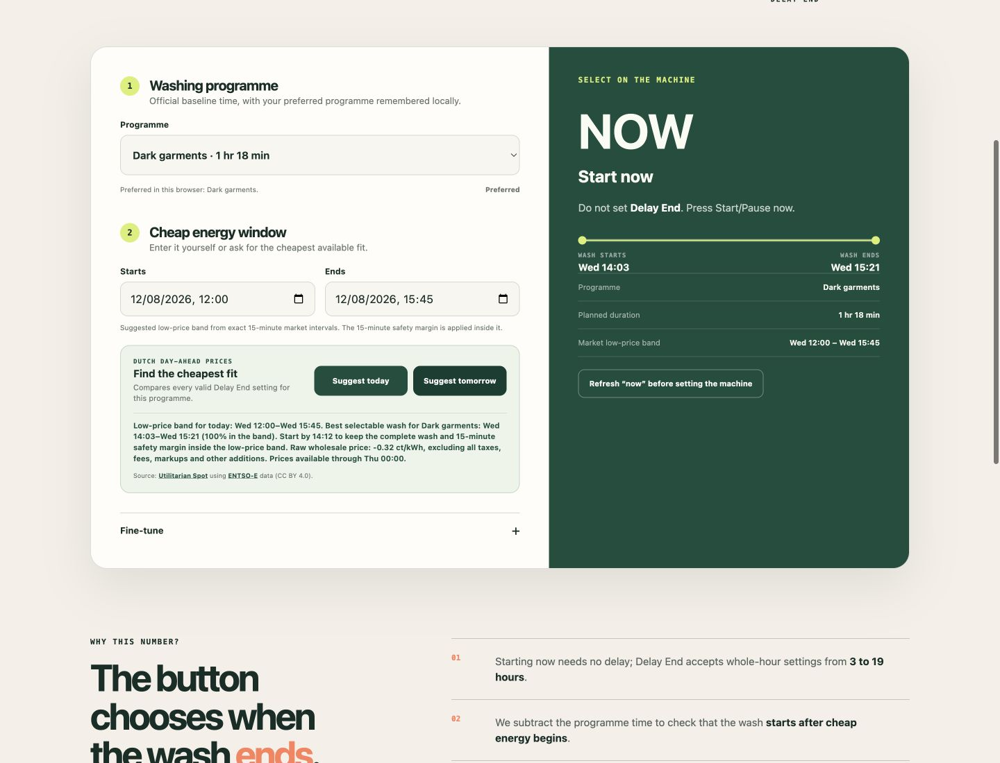
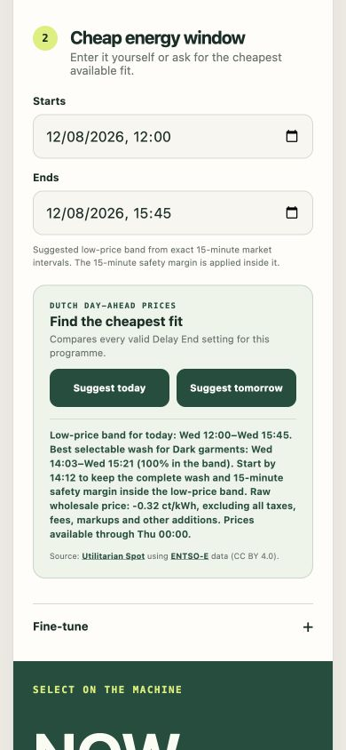

# Laundry Window

[](https://github.com/roelsroels/laundry-window/actions/workflows/validate.yml)

A tiny, dependency-free planner for the **Samsung WF702Y4BKWQ/EN** washing machine. Enter a cheap electricity-price window and a washing programme; Laundry Window calculates the whole-hour value to select with the machine's **Delay End / Uitgesteld einde** button.

The calculator runs entirely in the browser. It has no analytics, cookies, server-side code, build step, or package manager. On request, it downloads the latest Dutch day-ahead market-price feed to suggest the cheapest available schedule. The footer loads the optional Buy Me a Coffee button and its Bree Serif font from third-party CDNs. All publicly served files live under [`html/`](html/); repository documentation, tests, screenshots, and deployment configuration stay outside the web root.

> [!NOTE]
> The price button fetches the same public Netherlands feed URL for every visitor; programme, timing, and planning values are never added to that request or sent elsewhere. As with any web request, the price provider receives ordinary connection metadata such as the visitor's IP address. The footer support button separately loads JavaScript from `cdnjs.buymeacoffee.com`, loads a font from Google Fonts, and links to `buymeacoffee.com/roels`.

## Screenshots



<p align="center">
  
</p>

## What it handles

- Immediate Start now recommendations plus the machine's real Delay End range: **3–19 hours in whole-hour increments**
- Windows that cross midnight
- All eleven dial programmes listed in Samsung's manual
- Quick wash selections from 15–60 minutes
- A configurable safety margin around the cheap-price window
- Prewash, which Samsung documents as adding approximately 18 minutes
- Per-programme measured-time overrides, stored only in the current browser
- A preferred programme, initially **Dark garments**, stored only in the current browser
- Complete English and Dutch interfaces, with the language stored only in the current browser
- Separate optional suggestions for today and tomorrow, once tomorrow’s prices are published
- A closest-fit suggestion when no setting keeps the complete wash inside the window
- A proportional timeline: green inside the cheap window and orange outside it

## Live market-price suggestions

The **Suggest today** and **Suggest tomorrow** buttons download Netherlands day-ahead prices from [Utilitarian Spot](https://spot.utilitarian.io/developer/). Tomorrow is offered as soon as both its prices and a valid 3–19 hour machine setting are available. The values originate from the ENTSO-E Transparency Platform and are supplied in `€/MWh` at the market’s available resolution, currently 15 minutes for the Netherlands.

Laundry Window evaluates the real duration of the selected programme against immediate Start now and every whole-hour Delay End choice from 3–19 hours. It recommends the reachable cycle with the lowest duration-weighted average market price. For today, it also shows the latest safe-start time that keeps the full cycle and selected safety margin inside the low-price band.

The green period remains separate from that machine-constrained recommendation. It is the longest contiguous low-price band for the chosen day, aligned to exact 15-minute intervals; its cutoff is `max(€5/MWh, the day’s minimum + €10/MWh)`. The start/end fields contain this actual band—not the proposed wash itself. If the best still-selectable wash extends beyond it, the timeline shows that portion in orange and reports the percentage that remains inside. This prevents a late request from making an already-missed cheap period look 100% reachable.

Refreshing “now” reruns the same day’s market optimisation so the washer setting cannot silently become stale.

The displayed figure is the **raw wholesale market price** (Dutch: **kale beursprijs**), converted to cents per kWh. It excludes every addition, including energy tax, VAT, network or supplier fees, supplier markups, and other contract costs. Fixed additions do not change which interval is cheapest, but users should still treat the result as a planning suggestion rather than an exact retail-price quote. The external feed is best-effort; manual entry remains available if it is late or unavailable.

## Compatibility

| Status | Samsung washing machines |
| --- | --- |
| **Physically verified** | `WF702Y4BKWQ/EN` |
| **Covered by the same official manual and programme table** | `WF702Y4BK**`, `WF702B4BK**`, `WF700Y4BK**`, `WF700B4BK**`, `WF602Y4BK**`, `WF602B4BK**`, `WF600Y4BK**`, `WF600B4BK**` |

The `**` characters represent regional or finish suffixes. The exact machine photographed and used while building the calculator is `WF702Y4BKWQ/EN`; the sibling families are documented by Samsung in the same manual but have not all been physically tested here.

Other Samsung models and other brands are **not currently assumed compatible**. The programme data is deliberately kept together in `html/app.js`, making a future brand/model selector straightforward once another machine's manual has been verified.

## Run locally

Open `html/index.html` directly, or serve only the `html/` web root. For example:

```sh
python3 -m http.server 8080 --directory html
```

Then open `http://localhost:8080`.

## Deploy with nginx

Clone or copy the repository to `/var/www/laundry-window`, then install the example vhost:

```sh
sudo cp nginx/laundry-window.conf.example /etc/nginx/sites-available/laundry-window
sudo ln -s /etc/nginx/sites-available/laundry-window /etc/nginx/sites-enabled/laundry-window
sudo nginx -t
sudo systemctl reload nginx
```

The vhost uses `/var/www/laundry-window/html` as its document root, so files such as the README, tests, source notes, screenshots, Git metadata, and nginx configuration are not web-accessible. Change `server_name` and `root` when your hostname or clone directory differs. For a local-only hostname, point `laundry-window.local` at the server in your local DNS or hosts file.

> [!IMPORTANT]
> The repository itself is public on GitHub. Moving the site into `html/` creates a clean nginx serving boundary; it does not make repository files private.

## GitHub Pages

The public site is automatically deployed from `html/` to:

**https://roelsroels.github.io/laundry-window/**

The Pages workflow uploads only the `html/` directory, preserving the same public-file boundary as the nginx configuration.

## Programme times

| Programme | Baseline |
| --- | ---: |
| Cotton | 133 min |
| Synthetics | 105 min |
| Jeans | 77 min |
| Bedding | 100 min |
| Dark garments | 78 min |
| Daily wash | 66 min |
| Eco drum clean | 104 min |
| Baby care | 142 min |
| Outdoor care | 72 min |
| Hand wash | 30 min |
| Wool | 38 min |

Samsung notes that actual cycle time can vary with water pressure and temperature, load, fabric, and selected options. See [the source notes](docs/SOURCES.md) for the exact manual references.

## Repository layout

```text
.
├── html/                    # Complete and only public web root
│   ├── index.html           # Website structure
│   ├── styles.css           # Responsive design
│   ├── i18n.js              # English/Dutch interface text and preference
│   ├── app.js               # Programme data and Delay End calculation
│   └── market-prices.js     # Browser-only market-price optimiser
├── nginx/                   # Example nginx vhost
├── docs/SOURCES.md          # Appliance documentation and caveats
├── screenshots/             # Real desktop and mobile captures
└── tests/smoke.mjs          # Dependency-free repository checks
```

## License

MIT
